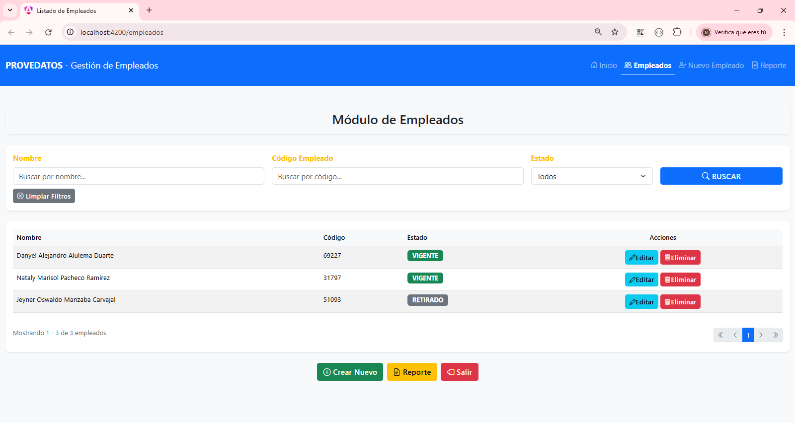
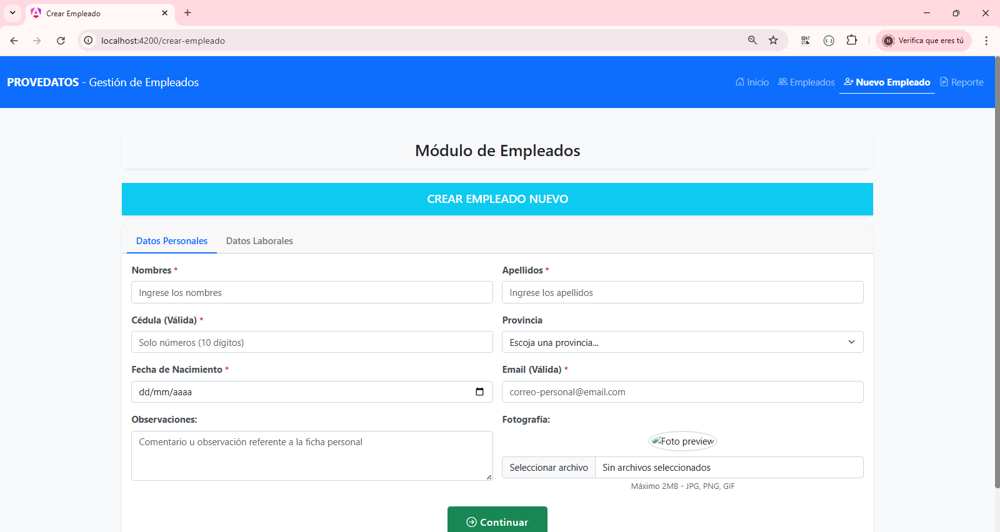
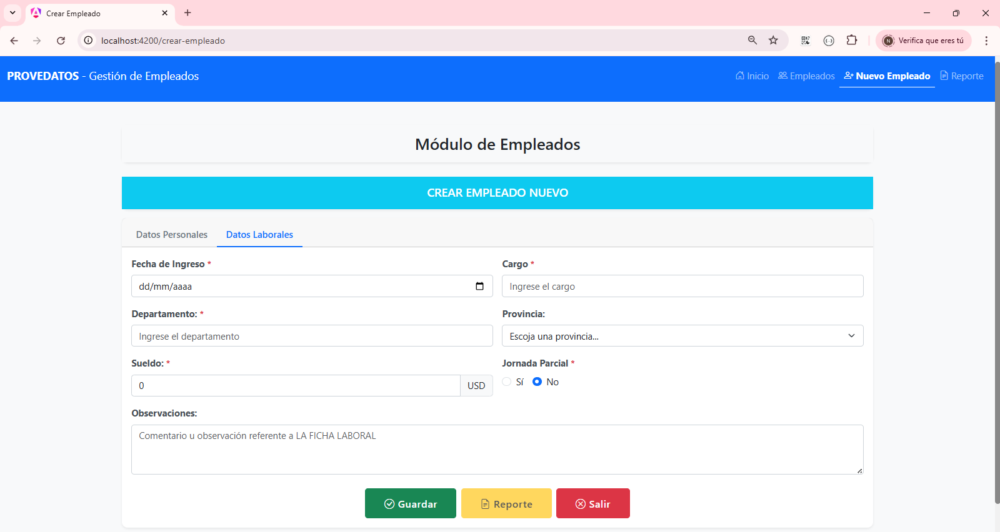
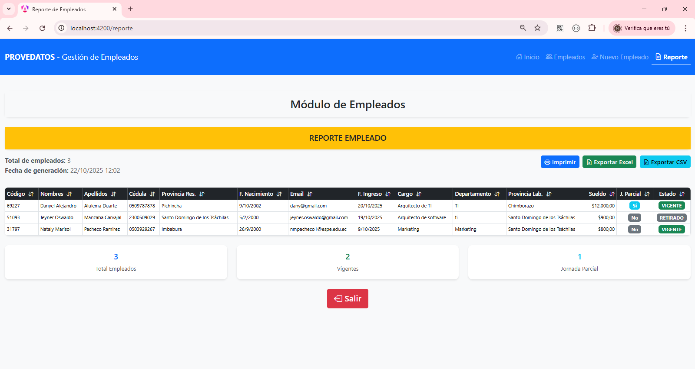

# 🎨 Sistema de Gestión de Empleados - Frontend

Frontend desarrollado en **Angular 19** con componentes standalone para el sistema de gestión de empleados de PROVEDATOS.

## ✨ Características

- ✅ **Componentes Standalone** - Arquitectura moderna de Angular 19
- ✅ **Diseño Responsive** - Bootstrap 5.3.3 para adaptación a todos los dispositivos
- ✅ **Búsqueda y Filtrado** - Sistema de búsqueda por nombre, código y estado
- ✅ **Paginación** - Navegación eficiente de grandes conjuntos de datos
- ✅ **Formularios con Validación** - Validación en tiempo real de datos
- ✅ **Gestión de Imágenes** - Carga y previsualización de fotografías
- ✅ **Reportes Ordenables** - Tabla con columnas ordenables por clic
- ✅ **Exportación a CSV** - Descarga de reportes en formato CSV
- ✅ **Impresión** - Funcionalidad de impresión optimizada
- ✅ **Navegación Intuitiva** - Sistema de pestañas para formularios multipaso

---

## 🛠️ Tecnologías Utilizadas

| Tecnología | Versión | Descripción |
|------------|---------|-------------|
| **Angular** | 19.2.16 | Framework principal |
| **TypeScript** | ~5.7.2 | Lenguaje de programación |
| **Bootstrap** | 5.3.3 | Framework CSS |
| **Bootstrap Icons** | 1.11.3 | Librería de iconos |
| **RxJS** | ~7.8.0 | Programación reactiva |
| **Node.js** | 22.19.0 | Entorno de ejecución |
| **NPM** | 11.0.0 | Gestor de paquetes |

---

## 📦 Requisitos Previos

Antes de comenzar, asegúrate de tener instalado:

- **Node.js** v18 o superior
- **NPM** v9 o superior
- **Angular CLI** v19 o superior
- **Backend Laravel** corriendo en `http://127.0.0.1:8000`

### Verificar versiones instaladas:

```bash
node --version
npm --version
ng version
```

---

## 🚀 Instalación

### 1. Clonar el repositorio

```bash
git clone <URL_DEL_REPOSITORIO>
cd GestionEmpleados-Frontend
```

### 2. Instalar dependencias

```bash
npm install
```

### 3. Instalar Bootstrap y Popper.js

```bash
npm install bootstrap@5.3.3
npm install @popperjs/core
```

---

## ⚙️ Configuración

### 1. Configurar la URL del Backend

Edita el archivo `src/app/core/config/api.config.ts`:

```typescript
export const API_CONFIG = {
  baseUrl: 'http://127.0.0.1:8000/api',
  endpoints: {
    provincias: '/provincias',
    empleados: '/empleados',
    empleadosReporte: '/empleados/reporte'
  }
};
```

### 2. Verificar configuración de Bootstrap

El archivo `angular.json` debe incluir:

```json
"styles": [
  "node_modules/bootstrap/dist/css/bootstrap.min.css",
  "src/styles.css"
],
"scripts": [
  "node_modules/bootstrap/dist/js/bootstrap.bundle.min.js"
]
```

---

## ▶️ Ejecución

### Modo Desarrollo

```bash
ng serve
```

La aplicación estará disponible en: **http://localhost:4200**

### Modo Desarrollo con puerto personalizado

```bash
ng serve --port 4500
```

### Modo Producción (Build)

```bash
ng build --configuration production
```

Los archivos compilados estarán en: `dist/gestion-empleados-frontend/`

---

## 📁 Estructura del Proyecto

```
src/
├── app/
│   ├── core/
│   │   ├── config/
│   │   │   └── api.config.ts              # Configuración de API
│   │   ├── models/
│   │   │   ├── empleado.ts                # Interface Empleado
│   │   │   └── provincia.ts               # Interface Provincia
│   │   └── services/
│   │       ├── api.service.ts             # Servicio base HTTP
│   │       ├── empleado.service.ts        # Servicio Empleados
│   │       └── provincia.service.ts       # Servicio Provincias
│   ├── pages/
│   │   ├── listado-empleados/             # Componente Listado
│   │   ├── crear-empleado/                # Componente Crear
│   │   ├── editar-empleado/               # Componente Editar
│   │   └── reporte-empleados/             # Componente Reporte
│   ├── shared/
│   │   └── navbar/                        # Componente Navbar
│   ├── app.component.ts                   # Componente raíz
│   ├── app.config.ts                      # Configuración app
│   └── app.routes.ts                      # Configuración rutas
├── assets/                                # Recursos estáticos
├── styles.css                             # Estilos globales
└── index.html                             # HTML principal
```

---

## 🎯 Funcionalidades

### 1. **Listado de Empleados**
- 📋 Vista de tabla con paginación (20 registros por página)
- 🔍 Búsqueda por nombre y código de empleado
- 🎚️ Filtro por estado (VIGENTE/RETIRADO)
- ✏️ Botones de acción: Editar y Eliminar
- 📄 Navegación de páginas con controles first/prev/next/last

### 2. **Crear Empleado**
- 📝 Formulario dividido en 2 pestañas:
  - **Datos Personales**: Nombres, Apellidos, Cédula, Provincia, Fecha de Nacimiento, Email, Observaciones, Fotografía
  - **Datos Laborales**: Fecha de Ingreso, Cargo, Departamento, Provincia Laboral, Sueldo, Jornada Parcial, Observaciones
- ✔️ Validación en tiempo real de todos los campos
- 📸 Carga de fotografía con previsualización
- 🔄 Navegación entre pestañas con validación

### 3. **Editar Empleado**
- ✏️ Carga automática de datos del empleado
- 🔄 Misma estructura de formulario que Crear
- 📊 Campo adicional de Estado (VIGENTE/RETIRADO)
- 🖼️ Preservación de fotografía existente

### 4. **Reporte de Empleados**
- 📊 Tabla completa con todos los empleados
- 🔽 Ordenamiento por columnas (click en headers)
- 🖨️ Función de impresión optimizada
- 📥 Exportación a CSV
- 📈 Estadísticas: Total, Vigentes, Jornada Parcial

---

## 📸 Capturas de Pantalla

### Listado de Empleados


### Crear Empleado - Datos Personales


### Crear Empleado - Datos Laborales


### Reporte


---

## 🔌 API Endpoints

El frontend consume los siguientes endpoints del backend:

| Método | Endpoint | Descripción |
|--------|----------|-------------|
| GET | `/api/provincias` | Obtener todas las provincias |
| GET | `/api/empleados` | Listar empleados con paginación |
| GET | `/api/empleados/{id}` | Obtener un empleado por ID |
| POST | `/api/empleados` | Crear nuevo empleado |
| POST | `/api/empleados/{id}` | Actualizar empleado (con FormData) |
| DELETE | `/api/empleados/{id}` | Eliminar empleado |
| GET | `/api/empleados/reporte` | Obtener reporte completo |

---

## 🚢 Despliegue

### Despliegue en Producción

1. **Build de producción:**
```bash
ng build --configuration production
```

2. **Los archivos generados en `dist/` se pueden desplegar en:**
   - **Netlify**
   - **Vercel**
   - **Firebase Hosting**
   - **AWS S3 + CloudFront**
   - **Servidor web tradicional (Apache/Nginx)**

### Ejemplo con Netlify:

```bash
npm install -g netlify-cli
netlify deploy --prod --dir=dist/gestion-empleados-frontend/browser
```

### Configuración de redirección (para SPA):

Crear archivo `_redirects` en `src/`:

```
/*    /index.html   200
```

Y agregar en `angular.json`:

```json
"assets": [
  "src/favicon.ico",
  "src/assets",
  "src/_redirects"
]
```

---

## 🐛 Solución de Problemas

### Error: "Cannot find module '@angular/...'"

```bash
npm install
```

### Error: CORS al conectar con backend

Verificar que el backend tenga configurado CORS correctamente en `config/cors.php`:

```php
'allowed_origins' => ['*'],
'allowed_methods' => ['*'],
'allowed_headers' => ['*'],
```

### Error: "ng: command not found"

```bash
npm install -g @angular/cli
```

### La aplicación no carga estilos de Bootstrap

Verificar que `angular.json` incluya Bootstrap en la sección `styles`.

### Imágenes no se muestran desde el backend

Verificar que el backend tenga configurado el storage link:

```bash
php artisan storage:link
```

Y que la URL en `editar-empleado.component.ts` sea correcta:

```typescript
this.fotoPreview = `http://127.0.0.1:8000/storage/${this.empleado.fotografia}`;
```

---

## 🤝 Contribuir

Las contribuciones son bienvenidas. Para cambios importantes:

1. Fork el proyecto
2. Crea una rama para tu feature (`git checkout -b feature/AmazingFeature`)
3. Commit tus cambios (`git commit -m 'Add some AmazingFeature'`)
4. Push a la rama (`git push origin feature/AmazingFeature`)
5. Abre un Pull Request

---

## 📝 Notas Importantes

- ⚠️ Este proyecto requiere que el **backend Laravel** esté corriendo
- 🔐 Las validaciones se realizan tanto en frontend como en backend
- 📁 Las imágenes subidas se almacenan en el backend en `storage/app/public/empleados/`
- 🔄 El proyecto usa **componentes standalone** (Angular 19+)
- 📱 Diseño **completamente responsive** adaptado a móviles, tablets y desktop

---

## 📄 Licencia

Este proyecto fue desarrollado como parte de un ejercicio de programación para **PROVEDATOS**.

---

## 👨‍💻 Autor

**Tu Nombre**
- GitHub: [@Jeyner17](https://github.com/Jeyner17)
- Email: jeyner.oswaldo@gmail.ocom

---

## 🙏 Agradecimientos

- **PROVEDATOS** por la oportunidad del challenge
- **Angular Team** por el excelente framework
- **Bootstrap Team** por el sistema de diseño

---

**Fecha de creación:** Octubre 2025  
**Versión:** 1.0.0  
**Estado:** ✅ Completado

---

## 📞 Soporte

Si tienes alguna pregunta o problema, por favor abre un issue en el repositorio.

---

Made with ❤️ for PROVEDATOS